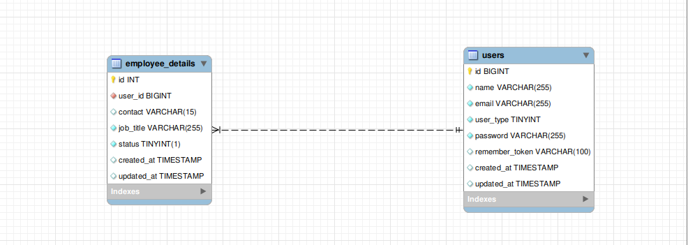

# HR Task #

### Exception messages inner App/Exceptions/Handler

### User Type [ HR, Employee]
### API [ HR -> CRUD User,Login ] [Employee -> Login, UpdateContact]
### MAIN API  ( Feel free to check Api collection ) 

### ER Diagram included below
______________________________________________________________________________________________________
# Run instructions - (SETUP) #

### 1.Clone Repository

### 2.cd into your project path

### 3.Install Composer Dependencies
    composer install

### 4.Create a copy of the .env file
    cp .env.example .env

### 5.Generate an app encryption key  
    php artisan key:generate

### 6. Create an empty database for the project

### 7.In the .env file, add database information to allow Laravel to connect to the database
    DB_DATABASE= DB name
    DB_USERNAME= root
    DB_PASSWORD= DB password

### 8.Migrate the database 
    php artisan migrate

### 9.Seed the database [ Users ]
    php artisan db:seed

### 10.Run application
    php artisan serve

### 11.use these credentials to login in
    email: hr@gmail.com
    password : hr12345

### View Route list
    php artisan route:list

______________________________________________________________________________________________________
### ER Diagram 

